  <a href="README.md">PT-BR</a> · <b>English</b>
    
  <picture>
    <source media="(prefers-color-scheme: dark)" srcset="assets/dark/header-en.svg">
    
  </picture>
  

    <a href="mailto:alessandro@hyperius.io"><picture><source media="(prefers-color-scheme: dark)" srcset="assets/dark/badge-email.svg"></picture></a>
    <a href="https://www.linkedin.com/in/alessandrocb"><picture><source media="(prefers-color-scheme: dark)" srcset="assets/dark/badge-linkedin.svg"></picture></a>
    <a href="https://scholar.google.com/citations?user=j656kewAAAAJ"><picture><source media="(prefers-color-scheme: dark)" srcset="assets/dark/badge-scholar.svg"></picture></a>
  

  <picture>
    <source media="(prefers-color-scheme: dark)" srcset="assets/dark/divisor.svg">
    
  </picture>

## About

I'm Alessandro Caetano Beltrão, a cloud and infrastructure engineer. Most of my work is on Microsoft Azure (AKS, Entra ID, Azure DevOps, Functions), Kubernetes, CI/CD pipelines and infrastructure as code, and I've managed infrastructure for clients such as Nubank, Carrefour, BMW, Prudential and Icatu Seguros. These days my focus is AI and DevOps.

I hold four Microsoft certifications: Azure Administrator Associate (AZ-104), Azure Developer Associate (AZ-204), Azure Solutions Architect Expert (AZ-305) and DevOps Engineer Expert (AZ-400). I have a B.Sc. in Software Engineering from the University of Brasília (UnB) and an M.Sc. in Systems Engineering and Computer Science from PESC (COPPE/UFRJ).

## Career

  <picture>
    <source media="(prefers-color-scheme: dark)" srcset="assets/dark/carreira-en.svg">
    
  </picture>

## Clients

  <picture>
    <source media="(prefers-color-scheme: dark)" srcset="assets/dark/clientes.svg">
    
  </picture>
   
  Icatu Seguros · Nubank · Odontoprev · CNseg · Movida · Carrefour · BMW · Inbenta · Caixa Capitalização · Prudential · Firjan

## Microsoft Azure certifications

  <a href="https://learn.microsoft.com/api/credentials/share/en-us/AlessandroCaetano-3389/131BC0E6E9B2EE6A?sharingId=110FFD27C5CD10EE"><picture><source media="(prefers-color-scheme: dark)" srcset="assets/dark/cert-az104.svg"></picture></a>
  <a href="https://learn.microsoft.com/api/credentials/share/en-us/AlessandroCaetano-3389/6442168655E07091?sharingId=110FFD27C5CD10EE"><picture><source media="(prefers-color-scheme: dark)" srcset="assets/dark/cert-az204.svg"></picture></a>
  <a href="https://learn.microsoft.com/api/credentials/share/en-us/AlessandroCaetano-3389/CB9B1B55C95165EC?sharingId=110FFD27C5CD10EE"><picture><source media="(prefers-color-scheme: dark)" srcset="assets/dark/cert-az305.svg"></picture></a>
  <a href="https://learn.microsoft.com/api/credentials/share/en-us/AlessandroCaetano-3389/88C998348DF2BF26?sharingId=110FFD27C5CD10EE"><picture><source media="(prefers-color-scheme: dark)" srcset="assets/dark/cert-az400.svg"></picture></a>

Click a card to see the credential on Microsoft Learn.

## Research and publications

Research on DevOps, continuous delivery and container orchestration.

- 2022 · [A Low-Cost Continuous Development Architecture Based on Container Orchestration](https://pesc.coppe.ufrj.br/uploadfile/publicacao/3072.pdf) · M.Sc. dissertation, PESC (COPPE/UFRJ)
- 2020 · [Performance Evaluation of Kubernetes as Deployment Platform for IoT Devices](https://web.archive.org/web/20240415192433/https://cibse2020.ppgia.pucpr.br/images/artigos/3/S03_P2.pdf) · CIbSE
- 2020 · [Technical Debt: A Clean Architecture Implementation](https://sol.sbc.org.br/index.php/cbsoft_estendido/article/view/14620) · CBSoft
- 2018 · [On the Benefits and Challenges of Using Kanban in Software Engineering: a Structured Synthesis Study](https://link.springer.com/article/10.1186/s40411-018-0057-1) · JSERD
- 2018 · [Using PageRank to Reveal Relevant Issues to Support Decision-Making on Open Source Projects](https://link.springer.com/chapter/10.1007/978-3-319-92375-8_9) · OSS, IFIP

The full list is on [Google Scholar](https://scholar.google.com/citations?user=j656kewAAAAJ).

## Stack

  <picture>
    <source media="(prefers-color-scheme: dark)" srcset="assets/dark/stack.svg">
    
  </picture>

## On the workbench

  <a href="https://github.com/alessandrocaetanob/smooth-operator">
    <picture>
      <source media="(prefers-color-scheme: dark)" srcset="assets/dark/projeto-en.svg">
      
    </picture>
  </a>

[Smooth Operator](https://github.com/alessandrocaetanob/smooth-operator) is a cloud-native vault for remote access (RDP, SSH and VNC) that runs in the browser with no client to install. It has RBAC, TOTP MFA, OIDC/SAML and file transfer during the session.

## Contributions

  <picture>
    <source media="(prefers-color-scheme: dark)" srcset="https://raw.githubusercontent.com/alessandrocaetanob/alessandrocaetanob/output/pacman-contribution-graph-dark.svg">
    <source media="(prefers-color-scheme: light)" srcset="https://raw.githubusercontent.com/alessandrocaetanob/alessandrocaetanob/output/pacman-contribution-graph.svg">
    
  </picture>

  <picture>
    <source media="(prefers-color-scheme: dark)" srcset="assets/dark/divisor.svg">
    
  </picture>
   
  <code>// end of file</code> · see you next time o/

