  

  

    
    
    
  

  
Nuvem, clusters e pipelines com capricho de terminal.

  

## A carreira em um git log

  

A história começa na Universidade de Brasília, onde me formei Bacharel em Engenharia de Software e trabalhei no Software Público Brasileiro, empacotando sistemas para Red Hat. De lá pra cá vieram pipelines de CI/CD para ambientes internos e externos, o Mestrado em Engenharia de Sistemas e Computação no PESC (COPPE/UFRJ) e a gestão de infraestrutura para clientes de peso:

  
  Icatu Seguros · Nubank · Odontoprev · CNseg · Movida · Carrefour · BMW · Inbenta · Caixa Capitalização · Prudential · Firjan

## Certificações Microsoft

  

Quatro certificações do ecossistema Azure: [AZ-104](https://learn.microsoft.com/pt-br/credentials/certifications/azure-administrator/) e [AZ-204](https://learn.microsoft.com/pt-br/credentials/certifications/azure-developer/) no nível Associate, [AZ-305](https://learn.microsoft.com/pt-br/credentials/certifications/azure-solutions-architect/) e [AZ-400](https://learn.microsoft.com/pt-br/credentials/certifications/devops-engineer/) no nível Expert.

## Pesquisa e publicações

Mestre em Engenharia de Sistemas e Computação pelo PESC (COPPE/UFRJ), com pesquisa em DevOps, entrega contínua e orquestração de containers.

- 2022 · [A Low-Cost Continuous Development Architecture Based on Container Orchestration](https://pesc.coppe.ufrj.br/uploadfile/publicacao/3072.pdf) · dissertação de mestrado, PESC/COPPE/UFRJ
- 2020 · [Performance Evaluation of Kubernetes as Deployment Platform for IoT Devices](https://cibse2020.ppgia.pucpr.br/images/artigos/3/S03_P2.pdf) · CIbSE
- 2020 · [Technical Debt: A Clean Architecture Implementation](https://sol.sbc.org.br/index.php/cbsoft_estendido/article/view/14620) · CBSoft
- 2018 · [On the Benefits and Challenges of Using Kanban in Software Engineering: a Structured Synthesis Study](https://link.springer.com/article/10.1186/s40411-018-0057-1) · JSERD
- 2018 · [Using PageRank to Reveal Relevant Issues to Support Decision-Making on Open Source Projects](https://link.springer.com/chapter/10.1007/978-3-319-92375-8_9) · OSS, IFIP

A lista completa está no [Google Scholar](https://scholar.google.com/citations?user=j656kewAAAAJ).

<!-- ORCID: quando criar o perfil, adicionar o link aqui -->

## Stack do dia a dia

- **Cloud:** Azure (AKS, Entra ID, DevOps, Functions, Container Apps)
- **Infra e DevOps:** Kubernetes, Traefik e ingress-nginx, CI/CD, IaC
- **Redes e segurança:** FortiGate, Zero Trust, Tailscale
- **Automação:** N8N, PowerShell, integrações com Microsoft Graph

## Na bancada

**[Smooth Operator](https://github.com/alessandrocaetanob/smooth-operator)**: cofre cloud-native e clientless para gerenciar conexões remotas (RDP, SSH e VNC) direto do navegador, com RBAC, MFA via TOTP, OIDC/SAML e transferência de arquivos em sessão.

## O fliperama das contribuições

  <picture>
    <source media="(prefers-color-scheme: dark)" srcset="https://raw.githubusercontent.com/alessandrocaetanob/alessandrocaetanob/output/pacman-contribution-graph-dark.svg">
    <source media="(prefers-color-scheme: light)" srcset="https://raw.githubusercontent.com/alessandrocaetanob/alessandrocaetanob/output/pacman-contribution-graph.svg">
    
  </picture>

  
  <code>$ exit</code> · sessão encerrada, até a próxima o/

