  <b>PT-BR</b> · <a href="README.en.md">English</a>
    
  <picture>
    <source media="(max-width: 600px) and (prefers-color-scheme: dark)" srcset="assets/dark/header-m.svg">
    <source media="(max-width: 600px)" srcset="assets/light/header-m.svg">
    <source media="(prefers-color-scheme: dark)" srcset="assets/dark/header.svg">
    
  </picture>
  

    <a href="mailto:alessandro@hyperius.io"><picture><source media="(prefers-color-scheme: dark)" srcset="assets/dark/badge-email.svg"></picture></a>
    <a href="https://www.linkedin.com/in/alessandrocb"><picture><source media="(prefers-color-scheme: dark)" srcset="assets/dark/badge-linkedin.svg"></picture></a>
    <a href="https://scholar.google.com/citations?user=j656kewAAAAJ"><picture><source media="(prefers-color-scheme: dark)" srcset="assets/dark/badge-scholar.svg"></picture></a>
  

  <picture>
    <source media="(prefers-color-scheme: dark)" srcset="assets/dark/divisor.svg">
    
  </picture>

## Sobre

Me chamo Alessandro Caetano Beltrão e sou engenheiro de cloud e infraestrutura. Trabalho principalmente com Microsoft Azure (AKS, Entra ID, Azure DevOps, Functions), Kubernetes, pipelines de CI/CD e infraestrutura como código, e já gerenciei a infraestrutura de clientes como Nubank, Carrefour, BMW, Prudential e Icatu Seguros. Hoje meu foco está em IA e DevOps.

Tenho quatro certificações Microsoft: Azure Administrator Associate (AZ-104), Azure Developer Associate (AZ-204), Azure Solutions Architect Expert (AZ-305) e DevOps Engineer Expert (AZ-400). Sou bacharel em Engenharia de Software pela UnB e mestre em Engenharia de Sistemas e Computação pelo PESC (COPPE/UFRJ).

## Trajetória

  <picture>
    <source media="(max-width: 600px) and (prefers-color-scheme: dark)" srcset="assets/dark/carreira-m.svg">
    <source media="(max-width: 600px)" srcset="assets/light/carreira-m.svg">
    <source media="(prefers-color-scheme: dark)" srcset="assets/dark/carreira.svg">
    
  </picture>

## Clientes

  <picture>
    <source media="(max-width: 600px) and (prefers-color-scheme: dark)" srcset="assets/dark/clientes-m.svg">
    <source media="(max-width: 600px)" srcset="assets/light/clientes-m.svg">
    <source media="(prefers-color-scheme: dark)" srcset="assets/dark/clientes.svg">
    
  </picture>
   
  Icatu Seguros · Nubank · Odontoprev · CNseg · Movida · Carrefour · BMW · Inbenta · Caixa Capitalização · Prudential · Firjan

## Certificações Microsoft Azure

  <a href="https://learn.microsoft.com/api/credentials/share/pt-br/AlessandroCaetano-3389/131BC0E6E9B2EE6A?sharingId=110FFD27C5CD10EE"><picture><source media="(prefers-color-scheme: dark)" srcset="assets/dark/cert-az104.svg"></picture></a>
  <a href="https://learn.microsoft.com/api/credentials/share/pt-br/AlessandroCaetano-3389/6442168655E07091?sharingId=110FFD27C5CD10EE"><picture><source media="(prefers-color-scheme: dark)" srcset="assets/dark/cert-az204.svg"></picture></a>
  <a href="https://learn.microsoft.com/api/credentials/share/pt-br/AlessandroCaetano-3389/CB9B1B55C95165EC?sharingId=110FFD27C5CD10EE"><picture><source media="(prefers-color-scheme: dark)" srcset="assets/dark/cert-az305.svg"></picture></a>
  <a href="https://learn.microsoft.com/api/credentials/share/pt-br/AlessandroCaetano-3389/88C998348DF2BF26?sharingId=110FFD27C5CD10EE"><picture><source media="(prefers-color-scheme: dark)" srcset="assets/dark/cert-az400.svg"></picture></a>

Clique num card para ver a credencial no Microsoft Learn.

## Pesquisa e publicações

Pesquisa em DevOps, entrega contínua e orquestração de containers.

- 2022 · [A Low-Cost Continuous Development Architecture Based on Container Orchestration](https://pesc.coppe.ufrj.br/uploadfile/publicacao/3072.pdf) · dissertação de mestrado, PESC (COPPE/UFRJ)
- 2020 · [Performance Evaluation of Kubernetes as Deployment Platform for IoT Devices](https://web.archive.org/web/20240415192433/https://cibse2020.ppgia.pucpr.br/images/artigos/3/S03_P2.pdf) · CIbSE
- 2020 · [Technical Debt: A Clean Architecture Implementation](https://sol.sbc.org.br/index.php/cbsoft_estendido/article/view/14620) · CBSoft
- 2018 · [On the Benefits and Challenges of Using Kanban in Software Engineering: a Structured Synthesis Study](https://link.springer.com/article/10.1186/s40411-018-0057-1) · JSERD
- 2018 · [Using PageRank to Reveal Relevant Issues to Support Decision-Making on Open Source Projects](https://link.springer.com/chapter/10.1007/978-3-319-92375-8_9) · OSS, IFIP

A lista completa está no [Google Scholar](https://scholar.google.com/citations?user=j656kewAAAAJ).

<!-- ORCID: quando criar o perfil, adicionar o link aqui -->

## Stack

  <picture>
    <source media="(max-width: 600px) and (prefers-color-scheme: dark)" srcset="assets/dark/stack-m.svg">
    <source media="(max-width: 600px)" srcset="assets/light/stack-m.svg">
    <source media="(prefers-color-scheme: dark)" srcset="assets/dark/stack.svg">
    
  </picture>

## Na bancada

  <a href="https://github.com/alessandrocaetanob/smooth-operator">
    <picture>
      <source media="(max-width: 600px) and (prefers-color-scheme: dark)" srcset="assets/dark/projeto-m.svg">
      <source media="(max-width: 600px)" srcset="assets/light/projeto-m.svg">
      <source media="(prefers-color-scheme: dark)" srcset="assets/dark/projeto.svg">
      
    </picture>
  </a>

[Smooth Operator](https://github.com/alessandrocaetanob/smooth-operator) é um cofre cloud-native de acessos remotos (RDP, SSH e VNC) que roda direto no navegador, sem cliente instalado, com RBAC, MFA via TOTP, OIDC/SAML e transferência de arquivos durante a sessão.

## Contribuições

  <picture>
    <source media="(prefers-color-scheme: dark)" srcset="https://raw.githubusercontent.com/alessandrocaetanob/alessandrocaetanob/output/pacman-contribution-graph-dark.svg">
    <source media="(prefers-color-scheme: light)" srcset="https://raw.githubusercontent.com/alessandrocaetanob/alessandrocaetanob/output/pacman-contribution-graph.svg">
    
  </picture>

  <picture>
    <source media="(prefers-color-scheme: dark)" srcset="assets/dark/divisor.svg">
    
  </picture>
   
  <code>// fim do arquivo</code> · até a próxima o/

