  

  

---

### Tecnologias e Ferramentas

  

- **Cloud:** Azure (AKS, Entra ID, DevOps, Functions, Container Apps)
- **Infra e DevOps:** Kubernetes, Traefik/ingress-nginx, CI/CD, IaC
- **Redes e Segurança:** FortiGate, Zero Trust, Tailscale
- **Automação:** N8N, PowerShell, integrações com Microsoft Graph

### Clientes e Projetos

Ao longo da carreira, atuei em projetos de infraestrutura, cloud e integração para empresas como:

Icatu Seguros, CNSeg, Nubank, Votorantim, Kard Bank, Grupo Ultra, Odontoprev, Carrefour e Firjan.

### Projeto em destaque

**[Smooth Operator](https://github.com/alessandrocaetanob/smooth-operator)**: aplicação cloud-native que funciona como um cofre centralizado e clientless para gerenciamento de conexões remotas (RDP, SSH, VNC), com transferência de arquivos em sessão via SFTP/RDP.

---

### Estatísticas

  
  

  

  <picture>
    <source media="(prefers-color-scheme: dark)" srcset="https://raw.githubusercontent.com/alessandrocaetanob/alessandrocaetanob/output/pacman-contribution-graph-dark.svg">
    <source media="(prefers-color-scheme: light)" srcset="https://raw.githubusercontent.com/alessandrocaetanob/alessandrocaetanob/output/pacman-contribution-graph.svg">
    
  </picture>

---

### Contato

  
  

  

